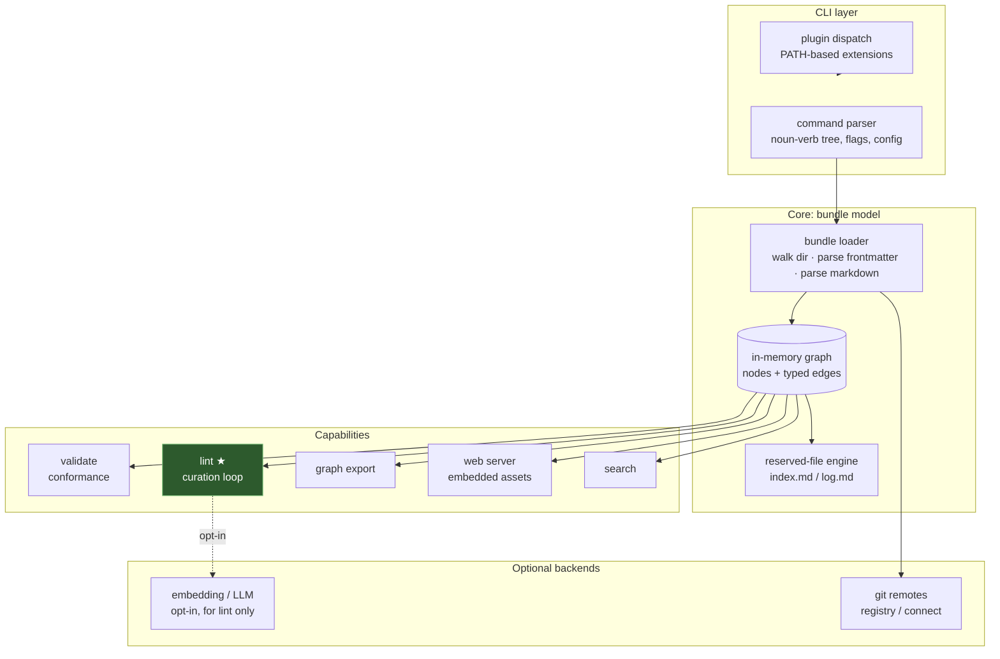

# okfctl — Product Requirements Document

**Status:** Draft · **Owner:** Casey West · **License:** Apache-2.0

> This document specifies `okfctl`, a command-line tool for managing Open
> Knowledge Format (OKF) bundles. It is a planning artifact: it defines the
> problem, the product thesis, the command surface, the architecture, and the
> open decisions that gate implementation. The language and library-stack
> section is deliberately deferred to an evidence-backed decision (see
> [§9, Open Decisions](#9-open-decisions)) and will be filled by a revision to
> this PRD before any code is written.

## 1. Summary

`okfctl` is a single-binary, extensible command-line tool for the full lifecycle
of an Open Knowledge Format bundle — creating and validating bundles, authoring
and editing nodes, maintaining the reserved `index.md` and `log.md` files,
querying the knowledge graph, and serving an interactive web visualization. It is
modeled on the ergonomics of `git`, `kubectl`, and `gcloud`: a noun-verb command
tree, first-class configuration, shell completion, and a plugin model that lets
the community extend it without forking.

Its distinguishing capability is a **curation loop** — a `lint` verb that checks a
bundle for the failure modes a static format cannot catch on its own:
contradictions between nodes, stale claims, orphaned nodes, and missing
cross-references. This is the maintenance process the OKF specification omits, and
it is the reason `okfctl` earns a place next to the tools that already exist.

## 2. Problem Statement

The Open Knowledge Format (OKF v0.1, Google Cloud) standardizes how knowledge is
packaged for humans and agents: a directory of Markdown files with YAML
frontmatter, where the file path is the concept's identity, links form a
traversable graph, and two reserved files — `index.md` for progressive disclosure
and `log.md` for change history — anchor navigation and provenance. It is
deliberately minimal. The only required frontmatter field is `type`; consumers are
required to forgive almost everything else.

That minimalism is a strength for portability and a gap for operation. Three
problems follow.

### 2.1 Lifecycle management is manual or fragmented

Authoring a conformant node, keeping `index.md` and `log.md` current, and
validating structure are repetitive, error-prone tasks. Existing tooling covers
parts of this but no single tool covers the whole lifecycle with the extension
model a serious workflow needs.

### 2.2 The format standardizes the container, not the upkeep

OKF descends from Andrej Karpathy's *LLM-Wiki* pattern, which specified both a
container *and* a maintenance loop — periodically health-check the wiki for
contradictions, stale claims, orphan pages, missing cross-references, and
coverage gaps. OKF kept the container and dropped the loop. The consequence is a
named failure mode: *a field is not a process.* A `timestamp` records when a node
was written; nothing in the format runs to keep it true. Storage without an active
maintenance process produces silent staleness — and a knowledge base that *reads*
authoritative goes stale faster than one that admits it is a pile of chunks.

This is the load-bearing gap. It is not a criticism of Karpathy's pattern, which
includes the loop; it is a criticism of the container in isolation. No existing
OKF tool implements the missing verb.

### 2.3 A bundle is a graph, but it is hard to see

The value of OKF is in its edges — the cross-links that let a reader or agent
traverse from concept to concept. A directory of Markdown files does not make that
graph visible. Understanding a bundle's shape, spotting orphans, and navigating by
reader-goal all benefit from a rendered, interactive view that the raw files do
not provide.

## 3. Product Thesis

`okfctl` is not another bundle scaffolder. It is the tool that ships **the verb
the format omits**, on top of complete lifecycle management and an interactive
visualizer, in an extensible package.

Three pillars, in priority order:

1. **Lifecycle** — create, validate, author, and maintain a bundle and its
   reserved files, correctly and repeatably. Table stakes; must be excellent.
2. **Curation** — the differentiator. A `lint`/curation loop that makes staleness,
   contradiction, orphaning, and missing links *detectable*, then actionable. This
   is what no existing tool does and what the format most needs.
3. **Visualization** — a built-in web server that renders the bundle as a
   navigable, interactive knowledge graph.

Wrapped around all three: a `git`/`kubectl`-style **extension model** so the tool
grows through community plugins rather than a monolith.

## 4. Prior Art

Two tools exist and define the baseline. Neither addresses the curation gap, the
built-in web visualizer, or an extension model.

| Capability | `openknowledge` (Google, reference) | `scrinium` (community) | `okfctl` (this) |
|---|---|---|---|
| Language | JavaScript / Node | Rust | *see §9* |
| Scaffold / create bundle | Yes | Yes | Yes |
| Validate structure | Yes | Yes | Yes |
| Node create / edit | Partial | Yes (+ TUI editor) | Yes |
| `index.md` / `log.md` maintenance | Yes | Yes (auto) | Yes |
| Graph export | No | Yes (JSON/YAML/SVG/PNG) | Yes |
| Interactive **web** visualizer | No | No | **Yes** |
| **Curation / lint loop** | No | No | **Yes** |
| Extension / plugin model | No | No | **Yes** |
| Registry / connect | Yes | No | Yes |

The takeaway: the scaffolding and validation ground is well-covered and `okfctl`
must meet it, but the maintenance loop, the interactive visualizer, and the
extension model are open ground — and the first of those is grounded in a verified
critique of the format itself, not a guess about what users might want.

## 5. Goals and Non-Goals

### 5.1 Goals

- Manage the full OKF bundle lifecycle from one tool, correctly and repeatably.
- Implement the curation loop the format omits, as a first-class `lint` verb.
- Provide an interactive, built-in web visualization of the knowledge graph.
- Ship as a single, self-contained binary with no runtime dependencies.
- Support a `git`/`kubectl`-style plugin model for community extension.
- Remain strictly conformant to, and permissive per, the OKF specification.
- Be a well-behaved open-source project: Apache-2.0, clear contribution path,
  reproducible builds, generated shell completions.

### 5.2 Non-Goals (v1)

- **Not** a hosted service, registry backend, or account system. OKF is a format,
  not a platform; `okfctl` operates on local bundles and git remotes.
- **Not** a general Markdown wiki engine or a replacement for an editor.
- **Not** a vector database or a RAG pipeline. The graph is traversed
  deterministically; embeddings, if used at all, serve curation checks only.
- **Not** a spec-authoring tool. `okfctl` consumes the OKF spec; it does not
  define it.

## 6. Command Surface

The command tree follows the noun-verb convention. Nouns are the OKF objects
(`bundle`, `node`, `index`, `log`); verbs are lifecycle and query operations.
Cross-cutting commands (`validate`, `lint`, `graph`, `serve`, `search`) act on the
whole bundle.

```mermaid
graph TD
    okfctl["okfctl"]

    okfctl --> bundle["bundle<br/>init · info · validate"]
    okfctl --> node["node<br/>new · edit · show · mv · rm · list"]
    okfctl --> index["index<br/>build · check"]
    okfctl --> log["log<br/>append · show"]
    okfctl --> validate["validate<br/>(whole-bundle conformance)"]
    okfctl --> lint["lint ★<br/>orphans · contradictions · stale · missing-links"]
    okfctl --> graph["graph<br/>export (json/svg/dot)"]
    okfctl --> serve["serve<br/>(web visualizer)"]
    okfctl --> search["search<br/>(query the graph)"]
    okfctl --> registry["registry / connect<br/>(remotes & git sources)"]
    okfctl --> config["config<br/>get · set · list"]
    okfctl --> completion["completion<br/>(shell completions)"]
    okfctl --> plugin["plugin<br/>list · install · dispatch"]

    style lint fill:#2d5a2d,stroke:#7bc47b,color:#fff
```

### 6.1 Lifecycle commands

- **`bundle init`** — scaffold a minimal conformant bundle: root `index.md`,
  `log.md`, spec pin, directory shape. **`bundle info`** — summary of the bundle
  (node count, neighborhoods, graph stats). **`bundle validate`** — alias for
  whole-bundle `validate`.
- **`node new`** — create a conformant node with required frontmatter and a stable
  path. **`node edit`** — open a node for editing with frontmatter assistance.
  **`node show`** — print a node (exact read). **`node mv`** — rename/move a node
  and fix inbound links (path is identity, so a move is a graph operation, not a
  file operation). **`node rm`** — remove a node and report resulting orphans.
  **`node list`** — print the bundle tree.
- **`index build`** — regenerate `index.md` from the current bundle for progressive
  disclosure. **`index check`** — verify `index.md` matches the bundle.
- **`log append`** — add a conformant change entry. **`log show`** — print history.

### 6.2 Validation vs. curation — two distinct verbs

This distinction is central to the product and must not blur.

- **`validate`** answers *"is this a well-formed OKF bundle?"* — structural
  conformance against the spec. Permissive by design: the spec requires consumers
  to forgive almost everything, so `validate` enforces the floor, not a quality
  bar. Pass/fail, machine-checkable.
- **`lint`** answers *"is this bundle still healthy and true?"* — the curation
  loop. It surfaces judgment-worthy findings, not just format violations:
  - **Orphans** — nodes with no inbound links (unreachable by traversal).
  - **Missing cross-references** — nodes that mention a concept that has its own
    node but do not link to it.
  - **Stale claims** — nodes whose `modified` date and provenance suggest a source
    may have been superseded and should be re-verified.
  - **Contradictions** — nodes making claims that conflict with other nodes.
  - **Coverage gaps** — concepts referenced repeatedly but lacking their own node.

  `lint` is the direct implementation of the LLM-Wiki lint paragraph OKF dropped.
  Some checks are purely structural (orphans, missing links) and deterministic;
  others (contradictions, stale claims) may optionally call an embedding or LLM
  backend, which is why that capability is a configurable, opt-in backend rather
  than a hard dependency. `lint` never mutates the bundle; it reports. Fixing is a
  separate, explicit action.

### 6.3 Visualization and query

- **`serve`** — start a local web server that renders the bundle as an
  interactive, navigable knowledge graph: click a node to read it, follow edges,
  see orphans highlighted, filter by `type`/tag/neighborhood. Assets are embedded
  in the binary; no separate install. This is the gap neither existing tool fills.
- **`graph`** — export the graph in machine formats (`json`, `dot`, `svg`) for use
  in other tools and CI.
- **`search`** — query the graph from the CLI (by title, tag, type, or content).

### 6.4 Extension model — `git`/`kubectl`-style

`okfctl` dispatches unknown subcommands to executables named `okfctl-<name>` found
on `PATH`, exactly as `git` finds `git-<name>` and `kubectl` finds
`kubectl-<name>`. `okfctl foo bar` with an `okfctl-foo` on `PATH` invokes it with
`bar` and passes through flags and environment. **`plugin list`** discovers
installed extensions; **`plugin install`** is a convenience installer. This keeps
the core small and lets the community ship capabilities — exporters, importers,
domain-specific linters — without touching the core or waiting on a release.


## 7. Architecture

`okfctl` is a layered, single-binary application. The core parses and models the
bundle once; every command operates on that in-memory model.



Design principles:

- **Parse once, operate on the model.** The bundle is loaded into a typed graph
  (nodes, typed edges) a single time; commands are functions over that model. This
  keeps behavior consistent across `validate`, `lint`, `graph`, `serve`, and
  `search`.
- **Permissive load, strict where the spec is strict.** The loader forgives
  unknown keys and missing optional fields (per spec) but treats the reserved
  files and required fields as load-bearing.
- **Curation backends are opt-in.** Structural checks require nothing external.
  Semantic checks (contradiction, staleness) call a configurable backend only when
  enabled, so the default tool is fully offline and dependency-free.
- **Single binary, embedded assets.** The web visualizer's static assets ship
  inside the binary. One artifact, no runtime install.

## 8. Cross-Cutting Requirements

- **Conformance.** Strictly conformant to OKF v0.1; permissive per the spec's
  forgiveness requirement. The spec version is pinned and surfaced in
  `bundle info`.
- **Configuration.** Layered config (flags > environment > file > defaults) in the
  `git`/`gcloud` idiom, via `config get/set/list`.
- **Completions.** Generated shell completions for bash, zsh, and fish.
- **Distribution.** Single static binary; cross-compiled for macOS, Linux, and
  Windows; reproducible builds.
- **Testing.** A conformance test suite against known-good and known-bad bundles;
  golden-file tests for `index`/`log` generation; unit tests for each `lint`
  check.
- **Open source.** Apache-2.0, Contributor License Agreement, generated
  release artifacts, semantic versioning.

## 9. Open Decisions

### 9.1 Implementation language and library stack — *pending research*

The language and the core library stack are a foundational, costly-to-redo
decision that gates implementation. The leaning direction is **Go** — it is the
`kubectl`/`gcloud` lineage the tool models itself on, PATH-based extensions and an
embedded web server are idiomatic, and it fits the maintainer's primary language
and Google open-source context. That lean is explicitly **not** being
rubber-stamped: an evidence-backed spike is comparing Go and Rust across the
command framework, the extension mechanism, the embedded-server story, the
OKF-specific parsing/graph libraries, and support for the curation loop, and will
return one grounded recommendation.

This section will be replaced by the spike's verdict — the chosen language, the
named library stack, and the rationale — as a revision to this PRD before any
implementation begins.

### 9.2 Curation backend interface

The interface for the optional semantic-curation backend (contradiction and
staleness detection) — pluggable local embedding model, hosted API, or both —
will be specified once the language decision lands, since the idiom differs by
ecosystem.

### 9.3 Web visualizer front-end approach

Whether the visualizer ships a minimal vanilla front-end or a small framework
build is deferred to the language/embedding decision, since the asset-embedding
story is language-specific.

## 10. Success Criteria

`okfctl` succeeds if:

1. A user can take a directory of notes to a conformant, well-maintained OKF
   bundle — and keep it that way — using only this tool.
2. `lint` catches real staleness, orphans, contradictions, and missing links that
   `validate` alone cannot, closing the maintenance gap the format leaves open.
3. `serve` makes a bundle's graph genuinely navigable and its problems visible.
4. The extension model attracts at least one community plugin the core did not
   ship.
5. It is a healthy open-source project: contributors can build, test, and extend
   it from a clean checkout without friction.
