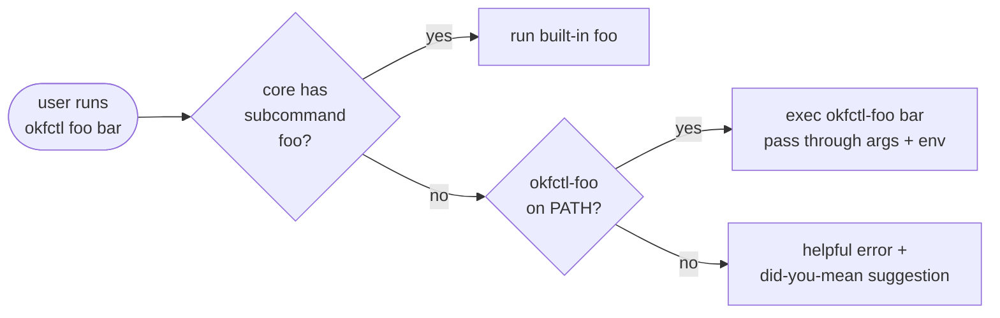
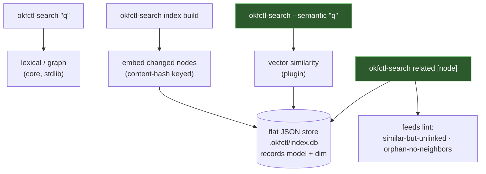
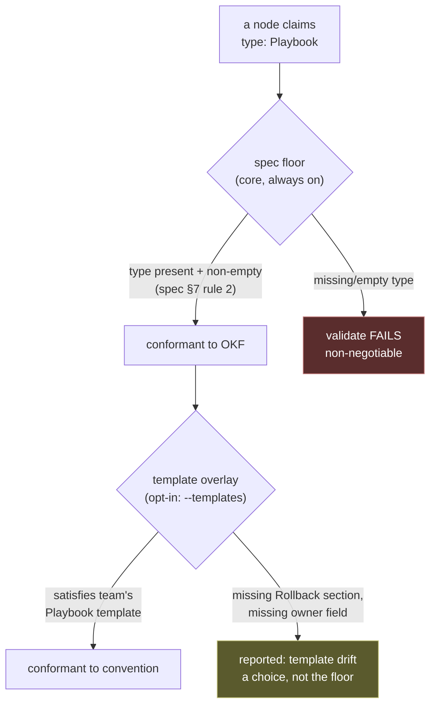
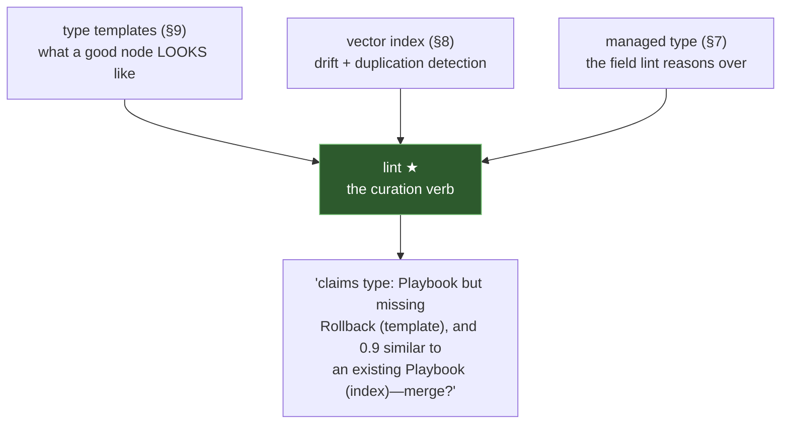
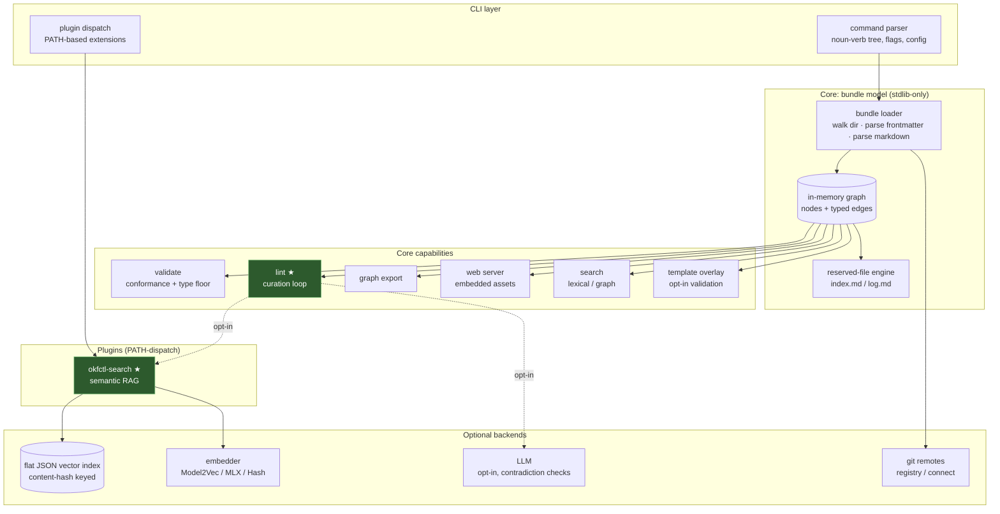

# okfctl—Product Requirements Document

**Status:** Draft · **Owner:** Casey West · **License:** Apache-2.0

> This document specifies `okfctl`, a command-line tool for managing Open
> Knowledge Format (OKF) bundles. It is a planning artifact: it defines the
> problem, the product thesis, the command surface, the architecture, and the
> open decisions that gate implementation. v1 is the full lifecycle CLI plus
> three shipped-on-launch capabilities—managed `type` conformance (§7), local
> vector search (§8), and a versioned type-template system (§9)—that together
> make the curation loop real. The implementation language is settled (Go; see
> [§13.1](#131-implementation-language-and-library-stackdecided-go)).

## 1. Summary

`okfctl` is a single-binary, extensible command-line tool for the full lifecycle
of an Open Knowledge Format bundle—creating and validating bundles, authoring
and editing nodes, maintaining the reserved `index.md` and `log.md` files,
querying the knowledge graph, and serving an interactive web visualization. It is
modeled on the ergonomics of `git`, `kubectl`, and `gcloud`: a noun-verb command
tree, first-class configuration, shell completion, and a plugin model that lets
the community extend it without forking.

Its distinguishing capability is a **curation loop**—a `lint` verb that checks a
bundle for the failure modes a static format cannot catch on its own:
contradictions between nodes, stale claims, orphaned nodes, and missing
cross-references. This is the maintenance process the OKF specification omits, and
it is the reason `okfctl` earns a place next to the tools that already exist.

Three v1 capabilities make that loop concrete rather than aspirational, and each
is fully specified below:

- **Managed `type` (§7).** `type` is the one field OKF requires on every node.
  `okfctl` treats its presence as a first-class managed concept: `validate`
  hard-fails a node with no `type`, `node new` requires one, and `node show`/`list`
  surface it—while never enforcing a fixed taxonomy of type *values*, which the
  spec forbids.
- **Local vector search (§8).** A semantic `search` plugin backed by a local
  embedding model and an on-disk flat vector index, adopting the exact `Embedder`
  protocol already in production in `cwest/knowledge-base`. It powers "similar but
  unlinked" and "orphan with no semantic neighbors" findings in `lint`, fully
  offline.
- **Type templates (§9).** A template system shipped *as its own OKF bundle*—each
  template is a node whose `type` is `Type Template`. It scaffolds new nodes and
  drives an opt-in, stricter validation overlay, keeping team conventions portable
  and versioned without putting a schema registry inside the tool.

## 2. Problem Statement

The Open Knowledge Format (OKF v0.1) standardizes how knowledge is packaged for
humans and agents: a directory of Markdown files with YAML frontmatter, where the
file path is the concept's identity, links form a traversable graph, and two
reserved files—`index.md` for progressive disclosure and `log.md` for change
history—anchor navigation and provenance. It is deliberately minimal. The only
required frontmatter field is `type`; consumers are required to forgive almost
everything else.

That minimalism is a strength for portability and a gap for operation. Three
problems follow.

### 2.1 Lifecycle management is manual or fragmented

Authoring a conformant node, keeping `index.md` and `log.md` current, and
validating structure are repetitive, error-prone tasks. Existing tooling covers
parts of this but no single tool covers the whole lifecycle with the extension
model a serious workflow needs.

### 2.2 The format standardizes the container, not the upkeep

OKF descends from Andrej Karpathy's *LLM-Wiki* pattern, which specified both a
container *and* a maintenance loop—periodically health-check the wiki for
contradictions, stale claims, orphan pages, missing cross-references, and
coverage gaps. OKF kept the container and dropped the loop. The consequence is a
named failure mode: *a field is not a process.* A `timestamp` records when a node
was written; nothing in the format runs to keep it true. Storage without an active
maintenance process produces silent staleness—and a knowledge base that *reads*
authoritative goes stale faster than one that admits it is a pile of chunks.

This is the load-bearing gap. It is not a criticism of Karpathy's pattern, which
includes the loop; it is a criticism of the container in isolation. No existing
OKF tool implements the missing verb.

### 2.3 A bundle is a graph, but it is hard to see

The value of OKF is in its edges—the cross-links that let a reader or agent
traverse from concept to concept. A directory of Markdown files does not make that
graph visible. Understanding a bundle's shape, spotting orphans, and navigating by
reader-goal all benefit from a rendered, interactive view that the raw files do
not provide.

### 2.4 Conventions live in people's heads, and search is lexical

Two smaller gaps compound the first three. First, a team settles on what a good
`Playbook` or `Reference` node looks like—which sections, which fields—but that
convention is unwritten and unenforced, so nodes drift apart over time. Second,
finding "the node about X" or "nodes near this one" is only as good as a
substring match; two nodes can say the same thing in different words, and nothing
notices. Both are curation problems: the first is *drift*, the second is
*duplication and missing links*. Detecting them needs a written convention and a
semantic view of the corpus—neither of which the raw files supply.

## 3. Product Thesis

`okfctl` is not another bundle scaffolder. It is the tool that ships **the verb
the format omits**, on top of complete lifecycle management and an interactive
visualizer, in an extensible package.

Three pillars, in priority order:

1. **Lifecycle**—create, validate, author, and maintain a bundle and its
   reserved files, correctly and repeatably. Table stakes; must be excellent.
2. **Curation**—the differentiator. A `lint`/curation loop that makes staleness,
   contradiction, orphaning, and missing links *detectable*, then actionable. This
   is what no existing tool does and what the format most needs.
3. **Visualization**—a built-in web server that renders the bundle as a
   navigable, interactive knowledge graph.

Wrapped around all three: a `git`/`kubectl`-style **extension model** so the tool
grows through community plugins rather than a monolith.

The three v1 capabilities in §§7–9 exist to serve pillar 2. Managed `type` gives
curation a reliable field to reason over; the vector index gives it a semantic
view of the corpus; type templates give it a written definition of what a good
node looks like. §10 shows how they interlock into the full maintenance loop.

## 4. Prior Art

A small in-the-wild OKF-CLI ecosystem already defines the baseline, and it is
overwhelmingly Go. The reference-grade tool is `openknowledge-sh/openknowledge`
(Go, Apache-2.0)—a community project, not a Google one; there is no `org:google`
openknowledge repository. `okfcli/okf` (Go, Apache-2.0) is the closest prior
art of all: its declared surface—create, validate, lint, index, search, and
graph OKF bundles, built to be driven by AI agents—is nearly `okfctl`'s exact
feature set. The one Rust reference is `scrinium` (crates.io v1.3.0, MIT), a
clap-based tool with a `ratatui` TUI and a WebView graph-export backend. None of
these ships the curation loop, the built-in interactive web visualizer, or an
extension model together.

| Capability | `openknowledge` (community, reference) | `okfcli/okf` (community) | `scrinium` (community) | `okfctl` (this) |
|---|---|---|---|---|
| Language | Go | Go | Rust | Go (see §13.1) |
| Scaffold / create bundle | Yes | Yes | Yes | Yes |
| Validate structure | Yes | Yes | Yes | Yes |
| Node create / edit | Partial | Yes | Yes (+ TUI editor) | Yes |
| `index.md` / `log.md` maintenance | Yes | Yes | Yes (auto) | Yes |
| Graph export | No | Yes | Yes (JSON/YAML/SVG/PNG) | Yes |
| Lint / index | Partial | Yes | Partial | Yes |
| Lexical / graph search (core, stdlib) | Partial | Yes | Partial | **Yes** |
| Semantic (vector) search | No | No | No | **Yes** |
| Type-template / convention system | No | No | No | **Yes** |
| Interactive **web** visualizer | No | No | No | **Yes** |
| **Curation / lint loop** | No | Partial | No | **Yes** |
| Extension / plugin model | No | No | No | **Yes** |
| Registry / connect | Yes | No | No | Yes |

The takeaway: the scaffolding and validation ground is well-covered—`okfcli/okf`
in particular overlaps heavily—and `okfctl` must meet it, but a *semantic*
curation loop, the interactive visualizer, and the extension model bundled into
one tool are open ground. The first of those is grounded in a verified critique
of the format itself, not a guess about what users might want.

## 5. Goals and Non-Goals

### 5.1 Goals

- Manage the full OKF bundle lifecycle from one tool, correctly and repeatably.
- Implement the curation loop the format omits, as a first-class `lint` verb.
- Make `type` a managed concept: enforce its presence, never its values (§7).
- Ship local semantic search over the corpus, offline and reproducible (§8).
- Ship a versioned, portable type-template system as an OKF bundle (§9).
- Provide an interactive, built-in web visualization of the knowledge graph.
- Ship the core as a single, self-contained binary with no runtime dependencies;
  heavy optional capabilities ride the plugin model, not the core.
- Support a `git`/`kubectl`-style plugin model for community extension.
- Remain strictly conformant to, and permissive per, the OKF specification.
- Be a well-behaved open-source project: Apache-2.0, clear contribution path,
  reproducible builds, generated shell completions.

### 5.2 Non-Goals (v1)

- **Not** a hosted service, registry backend, or account system. OKF is a format,
  not a platform; `okfctl` operates on local bundles and git remotes.
- **Not** a general Markdown wiki engine or a replacement for an editor.
- **Not** a general RAG serving platform. The vector index in §8 is scoped to
  curation and CLI query over a single bundle; it is not a hosted retrieval API.
- **Not** a taxonomy authority. `okfctl` manages the *presence* of `type` and,
  opt-in, a team's own template overlay; it never ships or enforces a fixed set of
  `type` values, per the spec (§7.4).
- **Not** a spec-authoring tool. `okfctl` consumes the OKF spec; it does not
  define it.

## 6. Command Surface

The command tree follows the noun-verb convention. Nouns are the OKF objects
(`bundle`, `node`, `index`, `log`, `template`); verbs are lifecycle and query
operations. Cross-cutting commands (`validate`, `lint`, `graph`, `serve`,
`search`) act on the whole bundle. The semantic side of `search` ships as a
PATH-dispatch plugin (`okfctl-search`), keeping its heavy embedding dependency out
of the core binary (§8.4).

```mermaid
graph TD
    okfctl["okfctl"]

    okfctl --> bundle["bundle<br/>init · info · validate"]
    okfctl --> node["node<br/>new · edit · show · mv · rm · list"]
    okfctl --> index["index<br/>build · check"]
    okfctl --> log["log<br/>append · show"]
    okfctl --> template["template<br/>list · show"]
    okfctl --> validate["validate<br/>conformance (+ --templates overlay)"]
    okfctl --> lint["lint ★<br/>orphans · contradictions · stale · missing-links"]
    okfctl --> graphcmd["graph<br/>export (json/dot)"]
    okfctl --> serve["serve<br/>(web visualizer)"]
    okfctl --> search["search<br/>lexical/graph (core)"]
    okfctl --> searchplugin["okfctl-search ★<br/>--semantic · index build · related (plugin)"]
    okfctl --> registry["registry / connect<br/>(remotes & git sources)"]
    okfctl --> config["config<br/>get · set · list"]
    okfctl --> completion["completion<br/>(shell completions)"]
    okfctl --> plugin["plugin<br/>list · install · dispatch"]

    style lint fill:#2d5a2d,stroke:#7bc47b,color:#fff
    style searchplugin fill:#2d5a2d,stroke:#7bc47b,color:#fff
```



### 6.1 Lifecycle commands

- **`bundle init`**—scaffold a minimal conformant bundle: root `index.md`,
  `log.md`, spec pin, directory shape. **`bundle info`**—summary of the bundle
  (node count, neighborhoods, graph stats). **`bundle validate`**—alias for
  whole-bundle `validate`.
- **`node new`**—create a conformant node with required frontmatter (including a
  non-empty `type`; see §7.2) and a stable path. **`node edit`**—open a node for
  editing with frontmatter assistance. **`node show`**—print a node (exact read),
  surfacing `type` (§7.3). **`node mv`**—rename/move a node and fix inbound links
  (path is identity, so a move is a graph operation, not a file operation).
  **`node rm`**—remove a node and report resulting orphans. **`node list`**—print
  the bundle tree with each node's `type` (§7.3).
- **`index build`**—regenerate `index.md` from the current bundle for progressive
  disclosure. **`index check`**—verify `index.md` matches the bundle.
- **`log append`**—add a conformant change entry. **`log show`**—print history.
- **`template list`** / **`template show`**—read the linked type-template bundle
  (§9.3). Read-only; templates are authored as ordinary OKF nodes.

### 6.2 Validation vs. curation—two distinct verbs

This distinction is central to the product and must not blur.

- **`validate`** answers *"is this a well-formed OKF bundle?"*—structural
  conformance against the spec. Permissive by design: the spec requires consumers
  to forgive almost everything, so `validate` enforces the floor, not a quality
  bar. The floor is small and non-negotiable: parseable frontmatter, a non-empty
  `type` on every node (§7.1), and well-formed reserved files. Pass/fail,
  machine-checkable. An optional `--templates` overlay (§9.4) adds a stricter,
  team-chosen pass on top—never part of the spec floor.
- **`lint`** answers *"is this bundle still healthy and true?"*—the curation
  loop. It surfaces judgment-worthy findings, not just format violations:
  - **Orphans**—nodes with no inbound links (unreachable by traversal).
  - **Missing cross-references**—nodes that mention a concept that has its own
    node but do not link to it, and (via §8) nodes semantically similar to another
    node with no edge between them.
  - **Stale claims**—nodes whose `modified` date and provenance suggest a source
    may have been superseded and should be re-verified.
  - **Contradictions**—nodes making claims that conflict with other nodes.
  - **Coverage gaps**—concepts referenced repeatedly but lacking their own node.
  - **Template drift**—nodes whose `type` has a governing template but whose
    fields or sections do not satisfy it (§9.4). A warning, not a validate failure.

  `lint` is the direct implementation of the LLM-Wiki lint paragraph OKF dropped.
  Some checks are purely structural (orphans, missing links) and deterministic;
  others (contradictions, stale claims, semantic near-duplicates) call the vector
  index (§8) or an LLM backend, which is why those capabilities are configurable,
  opt-in backends rather than hard dependencies. `lint` never mutates the bundle;
  it reports. Fixing is a separate, explicit action.

### 6.3 Visualization and query

- **`serve`**—start a local web server that renders the bundle as an
  interactive, navigable knowledge graph: click a node to read it, follow edges,
  see orphans highlighted, filter by `type`/tag/neighborhood. Assets are embedded
  in the binary; no separate install. This is the gap neither existing tool fills.
- **`graph`**—export the graph in machine formats (`json`, `dot`) for use
  in other tools and CI. For SVG, pipe DOT to Graphviz:
  `okfctl graph export --format dot | dot -Tsvg > graph.svg`.
- **`search`**—query the graph from the CLI. Core `search` is lexical and
  graph-structural (by title, tag, type, or content substring, plus neighborhood
  traversal), stdlib-only. Semantic (vector) search is the `okfctl-search` plugin
  (§8), which adds `--semantic`, `index build`, and `related`.

### 6.4 Extension model—`git`/`kubectl`-style

`okfctl` dispatches unknown subcommands to executables named `okfctl-<name>` found
on `PATH`, exactly as `git` finds `git-<name>` and `kubectl` finds
`kubectl-<name>`. `okfctl foo bar` with an `okfctl-foo` on `PATH` invokes it with
`bar` and passes through flags and environment. **`plugin list`** discovers
installed extensions; **`plugin install <source>`** copies an `okfctl-<name>`
executable into the managed plugins dir (default `$OKFCTL_CONFIG_HOME/plugins`,
override with `--dir`) so `plugin list` and dispatch find it. This keeps
the core small and lets the community ship capabilities—exporters, importers,
domain-specific linters, and the semantic-search plugin (§8)—without touching the
core or waiting on a release.



### 6.5 Remote bundle sources—`registry` and `connect`

Every other command operates on a local bundle directory; `registry` and
`connect` are how a remote bundle *becomes* a local directory. They are plain
**git remote** wiring for OKF bundles—not a hosted service, account system, or
schema registry (§5.2, §9.1). A "registry" here is a local, named directory of
remote sources, each a git URL; `okfctl` hosts nothing.

- **`registry add <name> <git-url>`**—register (or re-point) a named remote
  bundle source. **`registry list`**—list the registered `name → url` pairs.
  **`registry show <name>`**—print one source's URL. **`registry remove <name>`**
  (alias `rm`)—unregister a source. Named remotes live in the one okfctl config
  store (§12), keyed `registry.<name>`; there is no second config mechanism.
- **`connect <name|git-url> [dir]`**—materialize a remote source into a local
  directory over git. A registered name resolves to its URL; an ad-hoc git URL is
  used directly. A fresh destination is `git clone`d; an existing checkout of the
  same source is fast-forwarded (`git pull --ff-only`, never a history-rewriting
  merge); a non-empty directory that is not that checkout is left untouched.
  `okfctl` shells out to git and does no authentication of its own—reaching a
  private URL is git's concern (ssh agent, credential helper), exactly as with
  any git remote.

## 7. Managed `type`—the one required field

### 7.1 Why `type` is managed, not merely validated

OKF requires exactly one frontmatter field on every concept node: `type`
(spec §4.1). Conformance rule 2 states it plainly: *"Every frontmatter block
contains a non-empty `type` field."* A node with no `type`, or an empty one, is
non-conformant—full stop. Because `type` is the single field the whole format
guarantees, it is the field every downstream consumer routes, filters, and
presents on. `okfctl` therefore treats it as a first-class managed concept rather
than one validation check among many: it is enforced on the way in, prompted at
creation, and surfaced on the way out.

### 7.2 Creation—`node new` requires a `type`

`node new` MUST NOT create a node without a non-empty `type`. When invoked without
one it prompts for it (or, in non-interactive use, fails with a clear message and
a non-zero exit). When a governing template exists for the chosen `type`, `node
new` scaffolds from it (§9.3): it stubs the template's required fields and body
sections so the new node starts conformant to the team's convention as well as to
the spec.

### 7.3 Read—`node show` and `node list` surface `type`

`type` is what consumers route on, so `okfctl` never hides it. `node show`
includes it in the rendered frontmatter; `node list` prints it as a column so a
reader can see the shape of a bundle at a glance and filter by it. `serve` and
`search` filter by `type` for the same reason.

### 7.4 The hard boundary—presence, not a value allowlist

This is the line `okfctl` must not cross. The spec is explicit: type values are
*"not registered centrally"* and consumers *"MUST tolerate unknown types
gracefully"* (spec §4.1); defining a fixed taxonomy of concept types is an
explicit OKF non-goal. `okfctl` manages the **presence and non-emptiness** of
`type` and nothing more. It ships no built-in list of allowed values, and
`validate` never rejects a node because its `type` is unfamiliar. A bundle full
of types `okfctl` has never seen still passes `validate`.

Soft value-hygiene—flagging, say, fourteen near-duplicate spellings of one
conceptual type (`Playbook`, `playbook`, `Play Book`)—belongs in `lint` as a
**warning**, never in `validate` as a rejection. Normalization is a suggestion the
author may take or ignore; conformance is not at stake. Teams that want a stricter
value discipline express it through the opt-in template overlay (§9.4), which they
own and version, not through a taxonomy baked into the tool.

## 8. Semantic search—local vector RAG

### 8.1 Why

Core `search` is lexical and graph-structural: it finds nodes by substring and by
traversal. That misses the two curation problems in §2.4—two nodes saying the same
thing in different words, and a node that *should* link to a semantically adjacent
node but does not. Catching those needs vector similarity over the corpus. `okfctl`
ships it locally: no hosted API, no key, no network at query time.

### 8.2 Adopt the existing embedder protocol—do not reinvent it

`cwest/knowledge-base` already runs the OKF embedding architecture in production
at `tools/okf/embed.py`. `okfctl` MUST adopt that exact protocol; it MUST NOT
invent a parallel one. The seam is a single `Embedder` interface, and the model
behind it is a deployment choice, not a fork:

- **Interface.** An embedder is anything with `name` (string), `dim` (int), and
  `encode(texts) -> vectors`. That is the whole contract. Everything downstream
  (indexing, query, `related`) depends only on this interface.
- **Backends, with distinct roles:**
  - **Model2Vec**—`minishlab/potion-base-8M`, 256-dim, local CPU-only static
    embeddings. No API key, no GPU, no network at serve time. This is what the
    office already bakes into `search.json` for zero-runtime-dependency browser
    search; it is the default for a portable, offline index.
  - **MLX**—a local OpenAI-compatible embedding server (Qwen3-Embedding-0.6B,
    1024-dim, at `127.0.0.1:8080`), stdlib/urllib client only. A stronger
    retriever when the server is reachable.
  - **Hash**—deterministic, dependency-free, *not* semantic. Exists so
    artifact-shape tests and offline CI run without downloading a model. Same text
    yields the same vector.

Reproducibility is part of the contract: the office records the `model` field
alongside the baked vectors, and `okfctl` does the same in its index (§8.3) so a
rebuild is reproducible and a query made with a mismatched model is rejected
rather than silently wrong.

### 8.3 Store—flat Go-native JSON, keyed on content hash

> **Decided.** The store is a flat Go-native JSON file, **not** `sqlite-vec`.
> An earlier draft named a single-file SQLite database with the `sqlite-vec`
> extension (`asg017/sqlite-vec`); it was rejected because a CGO/C-extension
> breaks the static-binary, no-separate-install guarantee. See
> [ADR 0004](adr/0004-flat-json-vector-store.md).

- **Store.** A single flat, Go-serialized file (JSON), `.okfctl/index.db`, one
  per bundle: no SQLite, no server, no loadable native extension. It records the
  embedder's `model` and `dim` so a rebuild is reproducible and a query issued
  against a mismatched-model index is rejected—exactly the discipline
  `search.json` already applies. Similarity is a brute-force cosine scan over the
  stored vectors, instant at single-bundle scale (an ANN index is a later slice
  if scale ever demands it).
- **Freshness.** Each record is keyed on the node's **content hash**, the same
  primitive `lint` uses. `search index build` re-embeds only the nodes whose
  content changed; unchanged nodes keep their vectors. The index therefore cannot
  silently go stale—the "a field is not a process" discipline (§2.2) applied to the
  index itself. This is also the spike's explicit architectural recommendation:
  cache embedding results by content hash, because the loop is I/O-bound, not
  CPU-bound.

### 8.4 Architecture fit—a PATH-dispatch plugin, not core

Per the language spike, the core binary stays stdlib-only and statically linked
(§13.1). A local embedding model is a heavy optional dependency, so the semantic
side of `search` ships as a **PATH-dispatch plugin** (`okfctl-search`, the §6.4
model), not baked into core. Core keeps lexical and graph `search`; the plugin
adds `--semantic`. This keeps the promise in §5.1: the core is dependency-free,
and weight rides the plugin model.

The plugin MUST reconcile with the existing Python embedder rather than duplicate
it. Two implementation paths were on the table (§13.2); the build **decided the
native-Go path** ([ADR 0005](adr/0005-pure-go-embedder.md)):

1. **Shell out** to the existing `tools/okf` Python embedder—reuse the exact
   in-production code, at the cost of a Python runtime dependency for the plugin.
   *Rejected.*
2. **Re-implement** the Model2Vec client natively in Go against the same
   `Embedder` contract and the same model—no Python at runtime, at the cost of a
   faithful port that must track the protocol. **Chosen:** a pure-Go Model2Vec +
   WordPiece embedder in `internal/search`, verified to `1e-5` against upstream.

Either way, the protocol, the models, and the `model`-field reproducibility
discipline are shared with `cwest/knowledge-base`; only the language of the client
differs. Duplicating the *protocol* is not an option.

### 8.5 Command surface



- `okfctl search "q"`—lexical/graph query (core).
- `okfctl-search --semantic "q"`—vector-similarity query (plugin).
- `okfctl-search index build`—embed changed nodes into the flat JSON store.
- `okfctl-search related [node]`—nearest neighbors of a node; the primitive `lint`
  consumes for its semantic checks.

### 8.6 Payoff for curation

`lint` calls `search related` to turn similarity into findings: *"0.91 similar to
an existing node, no edge between them—missing link?"* and *"orphan with no
semantic neighbors—dead concept?"* The differentiating curation verb becomes
semantic, and it stays fully offline.

## 9. Type templates—a versioned convention bundle

### 9.1 The template system is an OKF bundle, not tool config

A team converges on what a good `Playbook` or `Reference` looks like—which fields
are required, which sections belong in the body. `okfctl` makes that convention
**writable, portable, and versioned** by shipping it as an ordinary OKF bundle
that `okfctl` consumes like any other. It is deliberately *not* core config and
*not* a schema registry inside the tool—either of those would violate the spec's
anti-taxonomy stance (§7.4). The convention lives in git, owned by the team, not
in the binary.

### 9.2 A template is a node whose `type` is `Type Template`

Each template is a normal OKF concept node. Its `type` is `Type Template`, and its
frontmatter declares the convention it governs:

```yaml
---
type: Type Template
target_type: Playbook            # the node.type this governs
required_fields: [title, description, owner]
recommended_fields: [tags, timestamp]
body_sections: [Trigger, Steps, Rollback, Verification]
---
```

Because a template is just a node, the template bundle is just a bundle: it
`validate`s, `lint`s, `index`es, and version-graphs with the same `okfctl`
commands as any knowledge bundle. It has its own `index.md`, its own `log.md`, its
own git history, and its own `okf_version`. A team publishes it once—say
`cwest/okf-type-templates`—and every knowledge bundle references it. Forking a
convention is forking a git repo, not patching the tool.

### 9.3 Scaffolding—`node new --type` reads the template

When a governing template exists for a `type`, `node new --type Playbook` scaffolds
from it: it prompts for the template's `required_fields`, stubs the
`recommended_fields`, and lays down the `body_sections` as empty headings. The new
node starts life conformant to both the spec floor and the team's convention. The
template bundle is read via `template list`/`template show` (§6.1).

### 9.4 Two-tier validation—spec floor vs. team overlay

`okfctl` keeps two validation tiers strictly separate, and the PRD states the
boundary so it cannot blur:



- **Spec conformance (core, always on).** `type` present and non-empty
  (spec §7, rule 2). Never negotiable, never opt-out. A bundle whose nodes carry
  types `okfctl` has never seen still passes—unknown types are fine (§7.4).
- **Template conformance (opt-in, via `validate --templates`).** Does a
  `Playbook` node satisfy the team's `Playbook` template—its `required_fields` and
  `body_sections`? This is a stricter overlay a team *chooses*, not the spec floor.
  A node that fails the overlay is reported as template drift (a `lint`
  warning-class finding in §6.2), not as a spec violation.

The overlay never leaks into the floor. `validate` without `--templates` is pure
spec conformance; `--templates` is the team's own, versioned discipline layered on
top.

### 9.5 Why this design

Three properties follow from making templates a bundle rather than tool config.
It keeps `okfctl` spec-pure: no taxonomy of values lives in the tool (§7.4). It
makes conventions portable and versioned: a git-shareable, forkable bundle with
its own history, not a config buried in a dotfile. And it dogfoods the format:
the tool's own convention system is expressed in the very format the tool
manages.

## 10. Interlock—the maintenance loop, made concrete

The three v1 capabilities are not three features stapled together; they are three
sides of the curation loop OKF omits, and `lint` sits in the middle consuming all
three.



The template bundle defines what a good node *looks like*. The vector index
detects *drift and duplication*—a node that has wandered from its template, or one
that restates a neighbor. `lint` reads both, against a `type` field it can rely on
being present, and produces the finding no static format can: *"this node claims
`type: Playbook` but is missing the `Rollback` section its template requires, and
it is 0.9 similar to an existing `Playbook`—merge, link, or keep?"* That is the
full maintenance loop OKF drops, made concrete. All three capabilities exist to
make the differentiating `lint`/curation verb real.

## 11. Architecture

`okfctl` is a layered, single-binary application. The core parses and models the
bundle once; every command operates on that in-memory model. Heavy optional
capabilities (semantic search) ride the plugin boundary, not the core.



Design principles:

- **Parse once, operate on the model.** The bundle is loaded into a typed graph
  (nodes, typed edges) a single time; commands are functions over that model. This
  keeps behavior consistent across `validate`, `lint`, `graph`, `serve`, and
  `search`.
- **Permissive load, strict where the spec is strict.** The loader forgives
  unknown keys and missing optional fields (per spec) but treats the reserved
  files and the required `type` field as load-bearing (§7).
- **Core is stdlib-only; weight rides plugins.** Structural checks, lexical
  search, and the embedded visualizer require nothing external. The semantic
  search plugin and any LLM contradiction backend are opt-in and out-of-core, so
  the default tool is fully offline and dependency-free.
- **Single binary, embedded assets.** The web visualizer's static assets ship
  inside the binary via `go:embed`. One artifact, no runtime install.
- **Reproducible indexes.** The vector index records its `model` and `dim` and is
  keyed on content hash, so a rebuild is deterministic and a stale or
  mismatched-model query is refused, not silently wrong (§8.3).

## 12. Cross-Cutting Requirements

- **Conformance.** Strictly conformant to OKF v0.1; permissive per the spec's
  forgiveness requirement. The required `type` floor (§7.1) and the reserved-file
  rules are enforced; everything else is soft. The spec version is pinned and
  surfaced in `bundle info`.
- **Configuration.** Layered config (flags > environment > file > defaults) in the
  `git`/`gcloud` idiom, via `config get/set/list`.
- **Completions.** Generated shell completions for bash, zsh, and fish.
- **Distribution.** Core: single static binary; cross-compiled for macOS, Linux,
  and Windows; reproducible builds. The `okfctl-search` plugin is distributed
  separately (§8.4), so the core's zero-dependency guarantee holds.
- **Testing.** A conformance test suite against known-good and known-bad bundles
  (including missing/empty `type`); golden-file tests for `index`/`log`
  generation; unit tests for each `lint` check; the Hash embedder (§8.2) for
  deterministic, model-free vector-index and `related` tests in CI; template-overlay
  tests over a fixture template bundle (§9).
- **Open source.** Apache-2.0, Contributor License Agreement, generated
  release artifacts, semantic versioning.

## 13. Foundational Decisions

Every foundational architectural decision below is now settled and shipped
except one. Each settled decision has a dedicated Architecture Decision Record
(ADR) in [`docs/adr/`](adr/README.md) carrying its full rationale, the rejected
alternative, and what the choice costs; the summaries here state the outcome and
link the record rather than re-arguing it. The one genuinely open item (§13.3) is
called out as such.

| Decision | Status | Record |
|---|---|---|
| Implementation language (§13.1) | Decided: Go | [ADR 0001](adr/0001-build-in-go.md) |
| Extension model (§6.4) | Decided: PATH-dispatch | [ADR 0002](adr/0002-path-dispatch-extension-model.md) |
| Managed `type` boundary (§7) | Decided: presence only | [ADR 0003](adr/0003-managed-type-presence-only.md) |
| Vector store (§8.3) | Decided: flat Go-native JSON | [ADR 0004](adr/0004-flat-json-vector-store.md) |
| Semantic-search build path (§13.2) | Decided: pure-Go embedder | [ADR 0005](adr/0005-pure-go-embedder.md) |
| Web visualizer front-end (§13.4) | Decided: vanilla JS + `go:embed` | [ADR 0006](adr/0006-vanilla-js-embedded-visualizer.md) |
| Curation backend interface (§13.3) | **Open** | — |

### 13.1 Implementation language and library stack—*decided: Go*

The language and core library stack are a foundational, costly-to-redo decision
that gates implementation. An evidence-backed prove-or-kill spike settled it:
`okfctl` is built in **Go**. The spike built a minimal proof-of-concept in both
Go and Rust on-box—a subcommand tree with flags, a `git`/`kubectl` PATH-dispatch
extension with environment context and exit-code passthrough, and a single-binary
embedded static web server—and exercised all three. Both languages cleared every
required capability, so the decision turned on four measured deltas, and each
favored Go or was neutral:

1. **Cross-compilation.** Go cross-compiled statically-linked `linux/amd64`,
   `linux/arm64`, `windows/amd64`, and `darwin/amd64` from one macOS box, one
   command each, with zero toolchain setup (verified: `file` reports a static
   ELF). Rust's cross-build to Linux from macOS failed at link without a
   cross-linker layer—real, recurring CI complexity for a multi-platform release
   matrix.
2. **Dependency surface for `serve`.** Go's embedded visualizer is stdlib-only
   (`net/http` + `go:embed`, zero third-party dependencies) versus Rust's
   ~90-crate `axum`→`tokio`→`hyper` tree—less supply-chain surface to audit for
   the same single-binary result.
3. **YAML-frontmatter maturity.** Every OKF file is Markdown with YAML
   frontmatter, so YAML parsing is load-bearing. Go's `yaml.v3` is mature and
   maintained; Rust's canonical `serde_yaml` is deprecated (latest published
   version `0.9.34+deprecated`) and its successor `serde_yaml_ng` is young.
4. **Prior art.** The in-the-wild OKF-CLI ecosystem is overwhelmingly Go
   (`openknowledge-sh/openknowledge`, `okfcli/okf`, `okfdump`, `agentic-wiki/wiki`),
   giving the richest body of directly-applicable prior art to study.

Rust's one clear win—a ~4x smaller binary (2.1 MB vs 8.6 MB)—is minor for a
developer/agent CLI shipped as a release artifact. The differentiating lint loop
is I/O- and LLM-latency-bound rather than CPU-bound, so it does not favor either
language; it should be architected around caching embedding/LLM results by
content hash (realized as the §8.3 content-hash-keyed index).

**Named stack (as built).** Command framework: `spf13/cobra` (Apache-2.0).
Extension model: PATH-dispatch (`okfctl-<name>`, the `kubectl`/`git` pattern),
plus an explicit `plugin list` discovery command (see
[ADR 0002](adr/0002-path-dispatch-extension-model.md)). Markdown+frontmatter
parsing: `goldmark` with `goldmark-meta` (MIT). YAML: `gopkg.in/yaml.v3`. Graph
structure and DOT/JSON export: **the standard library** — the link graph is a
small in-memory value type built and serialized in `internal/okf` with stdlib
`sort` and `encoding/json`, no third-party graph library. Embedded server:
`net/http` + `go:embed` (stdlib). Vector store for the `okfctl-search` plugin: a
**flat Go-native JSON store** keyed on content hash, brute-force cosine over the
corpus — no SQLite and no CGO/C-extension (see
[ADR 0004](adr/0004-flat-json-vector-store.md)). Distribution: `CGO_ENABLED=0`
static builds across `GOOS`/`GOARCH` for the core, with GoReleaser for the
release matrix. The full rationale for the language choice — cross-compilation,
dependency surface, YAML maturity, prior art, and Rust's one win — lives in
[ADR 0001](adr/0001-build-in-go.md).

> **Historical note.** An earlier draft of this stack named `sqlite-vec`
> (`asg017/sqlite-vec`) for the vector store and `dominikbraun/graph` for graph
> structure/export. Neither was adopted: `sqlite-vec` was rejected for its
> CGO/C-extension cost against the static-binary guarantee (see
> [ADR 0004](adr/0004-flat-json-vector-store.md)), and the graph handling is
> stdlib-only, so `go.mod`'s direct dependencies are exactly `spf13/cobra`,
> `yuin/goldmark-meta`, and `gopkg.in/yaml.v3`.

### 13.2 Semantic-search build path—shell out vs. native Go embedder

**Decided: a pure-Go native embedder.** See
[ADR 0005](adr/0005-pure-go-embedder.md).

The `okfctl-search` plugin reconciles with the in-production Python embedder by
**porting the protocol into Go, not shelling out to it** (§8.4). The BERT
WordPiece tokenizer and the Model2Vec static-model inference are re-implemented
natively in `internal/search`, so the plugin is a single, fully-offline static
binary with no Python, ONNX, or model server at runtime. The port is verified
faithful (vectors match the upstream `model2vec` library to within `1e-5`, and
the offline `HashEmbedder` is byte-identical to the shared `cwest/knowledge-base`
implementation), so the protocol, the models, and the `model`-field
reproducibility discipline stay shared with the KB — only the client language
differs. The cost of owning that port, and the rejected shell-out alternative,
are recorded in [ADR 0005](adr/0005-pure-go-embedder.md).

### 13.3 Curation backend interface

The interface for the optional LLM-backed semantic checks (contradiction
detection beyond vector similarity) remains open as a design task, now scoped to
the Go ecosystem. It sits behind the same opt-in boundary as the vector index and,
like it, should cache results by content hash. This is the **only remaining open
decision** in this section — every other item above is decided and shipped, with
an ADR. No decision has been made here yet, so there is no ADR to record.

### 13.4 Web visualizer front-end approach

**Decided: vanilla JS, a single `go:embed`-ed page, no build step.** See
[ADR 0006](adr/0006-vanilla-js-embedded-visualizer.md).

The `serve` visualizer ships a small, self-contained force-directed renderer in
one `index.html`, embedded into the binary via `go:embed`, with no npm/Node build
step. The rejected alternative (a JS framework build) and what the vanilla choice
costs as the viewer grows are recorded in
[ADR 0006](adr/0006-vanilla-js-embedded-visualizer.md).

## 14. Success Criteria

`okfctl` succeeds if:

1. A user can take a directory of notes to a conformant, well-maintained OKF
   bundle—and keep it that way—using only this tool.
2. `validate` enforces the `type` floor exactly (missing/empty `type` fails;
   unknown `type` values pass), and never enforces a taxonomy (§7).
3. `lint` catches real staleness, orphans, contradictions, missing links, and
   semantic near-duplicates that `validate` alone cannot, closing the maintenance
   gap the format leaves open.
4. `okfctl-search` builds a reproducible, content-hash-keyed vector index and
   answers semantic and `related` queries fully offline, using the shared
   `Embedder` protocol.
5. A team can publish a type-template bundle, scaffold nodes from it, and run the
   opt-in overlay—without any taxonomy living in the tool.
6. `serve` makes a bundle's graph genuinely navigable and its problems visible.
7. The extension model attracts at least one community plugin the core did not
   ship.
8. It is a healthy open-source project: contributors can build, test, and extend
   it from a clean checkout without friction.
