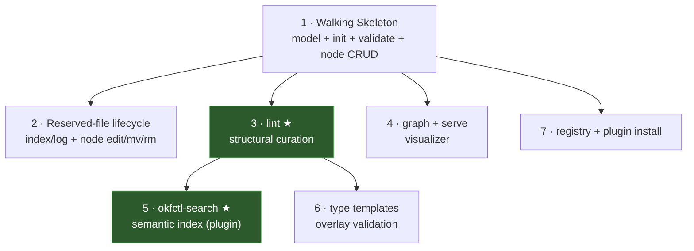

# okfctl Implementation Roadmap — multi-PR decomposition

> **For agentic workers:** this is the top-level sequencing doc. Each increment
> below becomes its OWN worktree → design spec → TDD plan → PR. Do NOT attempt
> more than one increment per branch. The PRD ([`docs/PRD.md`](../PRD.md)) is the
> product source of truth; this roadmap slices it into shippable pieces.

**Goal:** deliver the PRD's v1 as a sequence of independently-shippable
increments, each producing working, testable software on its own.

**Sequencing principle:** the core in-memory bundle model is load-bearing for
everything. Build it first (increment 1), then layer capabilities as functions
over it. The differentiator (`lint`) comes as soon as the model + a semantic
signal exist.

---

## Increment 1 — Walking Skeleton  ← THIS PR

**Delivers:** `init → author → validate`. Project foundation (Go module, cobra
tree, config, completion, CI), the core bundle model + loader, `bundle init`,
`validate` (spec floor incl. managed-`type`), `node new/show/list`.

Spec: [`docs/specs/2026-07-22-walking-skeleton.md`](../specs/2026-07-22-walking-skeleton.md)
Plan: [`docs/plans/2026-07-22-walking-skeleton.md`](2026-07-22-walking-skeleton.md)

## Increment 2 — Reserved-file lifecycle + remaining node verbs

**Delivers:** `index build/check`, `log append/show`, `node edit/mv/rm`. `node mv`
fixes inbound links (path is identity — a move is a graph operation). `node rm`
reports resulting orphans. Depends on: increment 1's model + reserved-file engine.

## Increment 3 — `lint` (the curation differentiator), structural checks

**Delivers:** `lint` with the deterministic, stdlib-only checks: orphans
(no inbound links), missing cross-references (mentions-a-node-without-linking),
coverage gaps, soft `type` value-hygiene warnings. NO semantic checks yet (those
need increment 5's index). This is the verb the format omits — ships as soon as
the model supports it. Depends on: increment 1.

## Increment 4 — `graph` export + `serve` web visualizer

**Delivers:** `graph export` (json/dot; SVG via `dot -Tsvg` pipe) and `serve` (embedded `net/http` +
`go:embed` interactive graph). §13.4 front-end approach (vanilla vs. small
framework) decided in that increment's brainstorm. Depends on: increment 1.

## Increment 5 — `okfctl-search` semantic plugin + `sqlite-vec` index

**Delivers:** the PATH-dispatch `okfctl-search` plugin (§8): `--semantic`,
`index build` (content-hash-keyed `sqlite-vec` store recording `model`+`dim`),
`related`. Adopts the `cwest/knowledge-base` `Embedder` protocol (name/dim/encode)
— MUST NOT reinvent it. **§13.2 fork decided here:** shell-out-to-Python vs.
native-Go re-implementation (deferred per Casey until this increment). Then wire
`lint`'s semantic findings (similar-but-unlinked, orphan-no-neighbors). Depends
on: increments 1 + 3.

## Increment 6 — Type templates + `validate --templates` overlay

**Delivers:** the type-template system as its own OKF bundle (§9) — templates are
nodes whose `type` is `Type Template`; `template list/show`; `node new --type`
scaffolds from a governing template; two-tier validation (`validate --templates`
overlay reports drift as warnings, never spec-floor failures). Depends on:
increments 1 + 3.

## Increment 7 — Registry / connect + plugin install convenience

**Delivers:** `registry`/`connect` (git remotes & sources), `plugin install`
convenience installer over the PATH-dispatch model already present in core.
Depends on: increment 1.

---

## Dependency graph

